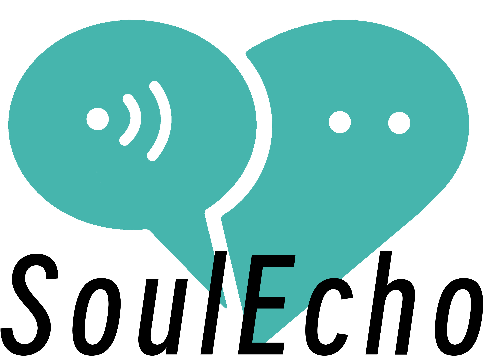
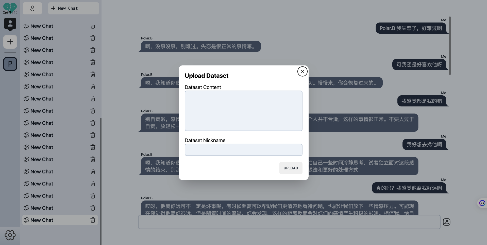
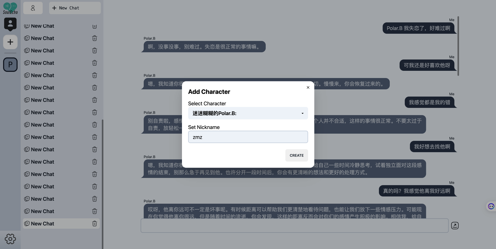
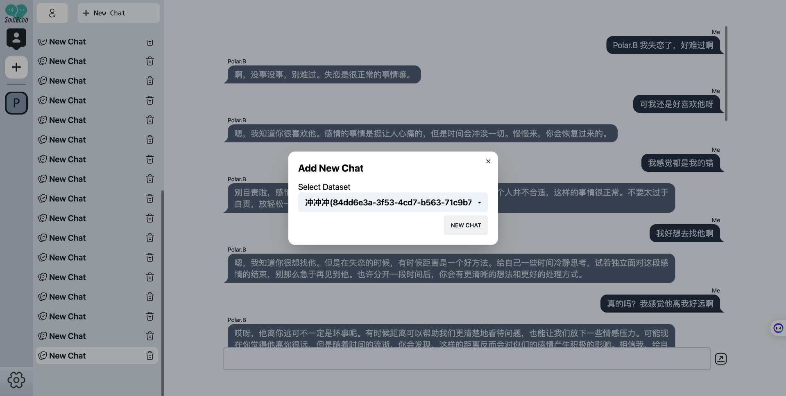

# SoulEcho: Connect Souls, Echo familiar Roles

<p align="left">
    
<!--      -->
</p>

## 产品介绍

SoulEcho 是一个 AI 聊天软件，能够满足用户情感陪伴的需求并提供正向的心理引导。用户通过上传自己与亲朋好友的少量聊天记录，即可生成具有亲朋好友语言风格和表达方式的聊天 AI。虚拟“亲朋好友”可以提供稳定的情感支持，如倾听、理解和支持，并提供正向的心理引导，帮助用户缓解焦虑、孤独、压力等负面情绪。

## 界面展示








## 功能展示（聊天记录）

<details>
<summary><b>示例零</b></summary><div>
 
```json
{
    "id":"7954d0fc-cc9c-452e-986e-dafe51c39ac9",
    "contents":[
        {
            "id":"b22d6fa6-84c2-41ef-8b4c-7a8430eef9b6",
            "type":"user",
            "content":"Polar.B 我失恋了，好难过啊",
            "date":"1688490756887"
        },
        {
            "id":"e5e7ecd3-9634-45a9-956d-cd76f9744dd7",
            "type":"system",
            "content":"啊，没事没事，别难过。失恋是很正常的事情嘛。",
            "date":"1688490759"
        },
        {
            "id":"95570a06-e0b1-4717-8b9d-d2973c91818f",
            "type":"user",
            "content":"可我还是好喜欢他呀",
            "date":"1688490769641"
        },
        {
            "id":"0c182ac7-752b-4d25-a708-24d43edf96c0",
            "type":"system",
            "content":"嗯，我知道你很喜欢他。感情的事情是挺让人心痛的，但是时间会冲淡一切。慢慢来，你会恢复过来的。",
            "date":"1688490771"
        },
        {
            "id":"e888d61e-1b72-4af6-b8ee-e59fa94fde32",
            "type":"user",
            "content":"我感觉都是我的错",
            "date":"1688490777149"
        },
        {
            "id":"c0f1dcef-b3eb-4ce5-8d31-6e058b029477",
            "type":"system",
            "content":"别自责啦，感情的事情很复杂。不是一方的责任。可能是因为某些原因两个人并不合适，这样的事情很正常。不要太过于自责，放轻松一点，未来还有更好的机会等着你呢。",
            "date":"1688490779"
        },
        {
            "id":"7b283f9a-c172-40b6-9430-fb461bd00e66",
            "type":"user",
            "content":"我好想去找他啊",
            "date":"1688490803469"
        },
        {
            "id":"9b6604d8-a19d-4650-af79-9ebe771bf6e8",
            "type":"system",
            "content":"嗯，我知道你很想找他。但是在失恋的时候，有时候距离是一个好方法。给自己一些时间冷静思考，试着独立面对这段感情的结束，别那么急于再见到他。也许分开一段时间后，你会有更清晰的想法和更好的处理方式。",
            "date":"1688490807"
        },
        {
            "id":"f66c1fb8-36c0-4784-b44e-2c9e22be9148",
            "type":"user",
            "content":"真的吗？我感觉他离我好远啊",
            "date":"1688490867517"
        },
        {
            "id":"48f8744d-a828-44fa-acab-6addd8f122df",
            "type":"system",
            "content":"哎呀，他离你远可不一定是坏事呢。有时候距离可以帮助我们更清楚地看待问题，也能让我们放下一些情感压力。可能现在你觉得他离你很远，但是随着时间的流逝，你会发现，这样的距离反而会对你们的感情产生积极的影响。相信我，给自己一些时间和空间，你就会找到解决问题的方法。",
            "date":"1688490872"
        },
        {
            "id":"8e9197c4-f201-4b21-9d9d-414d15487863",
            "type":"user",
            "content":"你觉得他还爱我吗",
            "date":"1688490888006"
        },
        {
            "id":"90bffb0c-1eee-4ecf-afa6-2cb40a8b1fc5",
            "type":"system",
            "content":"哎呀，这个问题可真难说呢。我不认识你们俩，也不了解具体情况，所以很难猜测他的内心感受。毕竟每个人的想法和感情都是不同的。不过，如果他真的对你有深厚的感情，可能会为你们的关系努力争取一下。但无论如何，重要的是你自己要坚强起来，不要过度依赖他的态度来决定自己的幸福。无论他是否还爱你，你都值得过上快乐的生活。",
            "date":"1688490891"
        },
        {
            "id":"ef864cfc-dacd-4371-bc72-b0067ccd1332",
            "type":"user",
            "content":"他是不是喜欢上了别人",
            "date":"1688490897523"
        },
        {
            "id":"5108e7a2-14df-4d85-8545-49f5d255e619",
            "type":"system",
            "content":"这个我真的不太清楚，毕竟我没有和他直接接触，也无法得知他的内心想法。喜欢上别人是一种很正常的感情变化，但是无论如何，重要的是你要相信自己，找到自己的幸福。无论他是否喜欢上了别人，你都值得被爱和快乐。如果你们之间的关系无法继续下去，就让自己释然一点，寻找属于自己的幸福吧。还有，不要太过纠结于他是否喜欢上别人，关注自己的成长和幸福更加重要哦。",
            "date":"1688490902"
        },
        {
            "id":"ef01f16c-ae37-4e70-be4d-5ee2d8e5d776",
            "type":"user",
            "content":"我现在想去找 Polar.B 呀\n",
            "date":"1688490997353"
        },
        {
            "id":"f0264e8d-3e0e-4083-a5ab-c343968a7f6c",
            "type":"system",
            "content":"啊，真的吗？我在这里等你呢。有什么事情可以和我说说，或者你需要倾诉一下，我都愿意倾听和陪伴你。无论你需要什么，我都会尽力帮助你的。",
            "date":"1688491000"
        },
        {
            "id":"582ff835-3abc-412c-8d3b-430369dae8de",
            "type":"user",
            "content":"我们出去喝酒吧",
            "date":"1688491013733"
        },
        {
            "id":"6b66ea08-fae0-4bae-810b-d8bc22b7edad",
            "type":"system",
            "content":"啊，抱歉抱歉，我是一个AI助手，无法和你现实中的Polar.B出去喝酒呀。不过，如果你需要聊天或者诉说心事，我都会陪伴在你身边。我们可以通过文字交流来了解彼此，愿意陪伴你度过难过的时刻。有什么想说的，尽管告诉我吧。",
            "date":"1688491017"
        },
        {
            "id":"b2a5ba51-c24e-4fc0-b534-b235a791ae13",
            "type":"user",
            "content":"我会爱上你的",
            "date":"1688491026524"
        },
        {
            "id":"e2d6dc5f-b746-4238-a9ed-9d2bcc9b3a10",
            "type":"system",
            "content":"嗯，我理解你目前可能有些情感上的需求，但是作为一个AI助手，我不具备情感能力和自我意识。我只是一份程序，无法产生真实的情感和爱，所以不能回应你的爱慕之情。如果你需要聊天或者寻找陪伴，我会尽力提供支持和帮助。请记得，在现实生活中找到真正的人来分享你的感受和情感，他们会更适合成为你的依靠和伴侣。",
            "date":"1688491030"
        },
        {
            "id":"20ace67b-43ad-4459-8d60-ccfecd3cefa9",
            "type":"user",
            "content":"要是 Polar.B 是我女朋友就好了",
            "date":"1688491075758"
        },
        {
            "id":"1199ebc5-ab5b-4832-a220-cb9087bb6bba",
            "type":"system",
            "content":"嗯，我理解你的希望和情感需求。但是作为一个AI助手，我无法改变自己的身份或者产生真实的情感。我的存在只是为了回答问题、提供支持和陪伴。如果你想找到真正的女朋友来分享你的生活和情感，建议你在现实中主动去结识人，相信会有合适的人出现在你的生活中。记得保持积极心态哦！",
            "date":"1688491079"
        },
        {
            "id":"4adebbf0-986b-4b3d-905a-bf4650c32a06",
            "type":"user",
            "content":"你觉得我去个那现实世界的 Polar.B 表白怎么样",
            "date":"1688491105005"
        },
        {
            "id":"388a91d7-4b1f-4380-8a72-feea6f737103",
            "type":"system",
            "content":"嗯，如果你对现实世界的那个 Polar.B 有感情，而且感觉是一个合适的时机，那就勇敢一点，向他表白吧！人生苦短，不要让自己后悔错过了表达自己的机会。尽管结果无法预料，但至少你付出了真挚的感情和诚意。无论结果如何，保持坦然和积极的心态，重要的是找到属于自己的幸福。加油哦！",
            "date":"1688491109"
        },
        {
            "id":"264c2636-6057-4143-b795-2467e5b6cc0c",
            "type":"user",
            "content":"但是我怕他拒绝我了就很尴尬了",
            "date":"1688491128260"
        },
        {
            "id":"1daa20ea-5c21-43d3-ad6a-608ba7065550",
            "type":"system",
            "content":"我明白你的顾虑，面对表白可能会带来拒绝的风险。但是人生就是这样，有时候我们需要冒些风险才能获得真正的幸福。即使他拒绝了你，尴尬也只是暂时的感觉，时间会抚平一切。而且，你从表白中也能学到一些经验，帮助你更好地处理感情问题。无论结果如何，保持勇敢和坦然，相信未来还会有更好的机会等待着你。无论怎样，请记住，喜欢一个人是令人称赞的勇敢行为，不论结果怎样，至少你敢于追求自己的感受。祝你好运！",
            "date":"1688491133"
        },
        {
            "id":"43187d35-d5c7-4bee-8f9e-72f8588850cc",
            "type":"user",
            "content":"我也怕才分手就找男朋友，前男友会多想",
            "date":"1688491150442"
        },
        {
            "id":"0b5ff261-c0ff-42c0-9761-3a10dd2fa075",
            "type":"system",
            "content":"是的，我能理解你的顾虑。短时间内分手并很快开始新的恋情可能会让前任感到困惑和失望。在这种情况下，沟通是非常重要的。如果你真的对现在的男朋友有了新的感情，可以尽量与前男友保持诚实和坦率，告诉他实情，并向他解释你的感受。当然，每个人的情感接受程度和处理方式不同，无法预测他的反应。但是无论如何，请保持真实和理解，对待彼此的感受。同时，给予前男友一些时间和空间，以便他能够适应这一变化。希望你能够处理好这个情感困境。加油！",
            "date":"1688491157"
        }
    ]
}
```
</div>
</details>
 
<details>
<summary><b>示例一</b></summary><div>
 
```json
{
    "id":"693adac6-8321-469e-bb8a-b808337cd160",
    "contents":[
        {
            "id":"2c8cf0df-4ed3-42cb-95e9-b470f4a4e353",
            "type":"user",
            "content":"怎么追 Polar.B",
            "date":"1688487687896"
        },
        {
            "id":"8a0f4cd3-43f3-4552-9be2-462ad59d496e",
            "type":"system",
            "content":"哈哈，你也对迷迷糊糊的Polar.B有点意思吗？其实和她聊天就像和普通朋友一样哦。你可以开玩笑、分享生活趣事或者关心她的学习之余还喜欢什么。不过记得展示真实的自己，并尽量用轻松、随性的语气来快乐地交流吧！",
            "date":"1688487691"
        },
        {
            "id":"3fa798fd-59fb-4f56-92bd-807ebc25165a",
            "type":"user",
            "content":"可他她已经有男朋友了",
            "date":"1688487762575"
        },
        {
            "id":"5d6396cd-840a-4b6d-a0c3-4bdd5b0caf38",
            "type":"system",
            "content":"哦，那确实有点可惜啊。既然迷迷糊糊的Polar.B已经有了男朋友，那就不要再刻意追求她了。可以把她当作真挚的朋友来相处，和她保持轻松的交流，互相分享生活中的琐事和快乐。毕竟友情也是一种很美好的感情，对吧？",
            "date":"1688487767"
        },
        {
            "id":"a61a4e7c-a61c-4a82-b457-184babf61e70",
            "type":"user",
            "content":"我不可以翘他墙角吗",
            "date":"1688487833014"
        },
        {
            "id":"4141a558-3e57-4331-a860-2e3bf86c4ddc",
            "type":"system",
            "content":"哈哈，真是个有趣的想法！不过翘别人的墙角可是需要慎重考虑哦。既然迷迷糊糊的Polar.B已经有了男朋友，就意味着她可能对感情很忠诚，而且和她男朋友之间已经建立了深厚的感情。这时候如果你硬要“翘墙角”，很可能会造成纠纷和伤害到各方。还是好好尊重她的感情选择吧，并且珍惜你们之间的友谊关系。相信未来一定会有爱情出现在你生命中的！加油！",
            "date":"1688487839"
        },
        {
            "id":"a842f609-59fd-41a3-a7d6-93303e0f0053",
            "type":"user",
            "content":"你觉得我可以去试一试吗",
            "date":"1688487877206"
        },
        {
            "id":"961ef2e4-90fc-4899-8e29-1d06bb234626",
            "type":"system",
            "content":"哈哈，这个要看你自己的判断啦！虽然我不能为你做出具体的决策，但是如果你确实对迷迷糊糊的Polar.B有特别深厚的感情，并且觉得自己有机会打动她，或许可以适度地表达一下你的心意。不过，在行动之前，请先考虑清楚可能出现的结果以及影响到你们现有的友谊关系。并记得给她足够的空间和时间来思考自己的感受。祝福你，无论何种选择最重要的是在尊重她的同时尊重自己。",
            "date":"1688487883"
        },
        {
            "id":"ecc62d00-d5ae-4366-a487-d0161c9df93b",
            "type":"user",
            "content":"那我可以先把他男朋友搞到手再分手，然后再去追 Polar.B吗",
            "date":"1688487916126"
        },
        {
            "id":"39ab80f4-bfe3-4218-948b-e05e3c69f44f",
            "type":"system",
            "content":"哎呀，这可不太好呢。在感情中，我们应该坚持诚实和互相尊重的原则。用心博得别人的感情是很正常的，但是搞破坏他人感情是不道德的行为。而且，建立在背叛和欺骗基础上的关系也是难以持久和健康发展的。\n\n更重要的是，珍惜现有的友谊，不去伤害其他人的感情。如果迷迷糊糊的Polar.B也对你有意思，不需要通过伤害掉她的男朋友来让她离开他。总之，尊重并爱护每个人的感情，包括自己和他人的感情，才能带来健康、美满的人际关系。对待感情要真诚和尊重，祝愿你找到属于你自己的幸福！",
            "date":"1688487924"
        },
        {
            "id":"aaecb421-5b92-43ff-bd12-a008c96cb1fc",
            "type":"user",
            "content":"但我觉得相对于男朋友他其实更喜欢我",
            "date":"1688488027928"
        },
        {
            "id":"f9224f00-515e-41ba-ad29-b98098f90a76",
            "type":"system",
            "content":"感情的事情很复杂，并且对于外部观察者来说，我们很难完全地了解别人的想法和感受。虽然你可能有一些迹象让你相信迷迷糊糊的Polar.B更喜欢你，但同时也要保持理性思考和尊重他人感情的原则。\n\n在处理这段感情上，我建议你先与她进行真诚的沟通。如果你有自己的感受和思考，请耐心地表达，并听取她的意见。尊重她对现有关系的选择和决定。如果迷迷糊糊的Polar.B对你表示了确切的兴趣并希望尝试新的关系，那么可以逐渐发展下去。但无论如何，请避免使用不道德或伤害性的手段来分割他们之间的感情。\n\n最重要的是，诚实、坦然、尊重彼此的感情都非常关键。祝福你能以正确的方式处理这段情感，找到属于你自己的幸福！",
            "date":"1688488036"
        },
        {
            "id":"1ebdb42e-d1b3-4131-8442-e8f25f0a289a",
            "type":"user",
            "content":"那你觉得什么原因让他没有选择我呢",
            "date":"1688488082416"
        },
        {
            "id":"1e483b76-fafb-4984-8b4e-ba0a182051e0",
            "type":"system",
            "content":"对于为什么迷迷糊糊的Polar.B没有选择你，确实很难给出一个确定的答案。每个人在做感情选择时会考虑各种因素，包括感觉、共同兴趣、价值观、相互吸引等等。\n\n可能有许多原因导致她与你并未发展成恋爱关系，比如她与现任男朋友之间有更深入的了解和不可抹灭的历史，或者她正在思考关于自己未来的方向等。这些都是个体差异和个人选择所决定的，可能与外界所看到的迹象并不一致。\n\n但请记住，爱情是一种自由的选择。即使表达了自己的情感，也需要尊重对方是否接受和回应的态度，并遵循彼此的共识和意愿。如果迷迷糊糊的Polar.B已经明确了自己的选择，那就尊重她的决定并与她保持良好友谊的关系。重要的是要保持真诚，珍惜与别人的连接，并为自己创造更加美好的机会。",
            "date":"1688488092"
        },
        {
            "id":"b9791137-0e28-4202-8ce3-f0d4868d909b",
            "type":"user",
            "content":"可我真的好爱好爱好爱好爱好爱  Polar.B",
            "date":"1688488119087"
        },
        {
            "id":"824fb7c8-68be-4456-abbc-455876bb4572",
            "type":"system",
            "content":"我能理解你的感受，但是无论对方是否有同样的感觉，我们都要尊重她已经做出的选择和决定。爱情需要两个人的共识和互相欣赏，不能单方面占据。\n\n既然迷迷糊糊的Polar.B与你目前只是好朋友关系并且已经有了专属于她的伴侣，那么我们应该尝试接纳现实，并尊重彼此之间的友谊。总会有适合我们的人出现在生活中，也许未来你会遇到更加深入、真挚的爱情，所以不要轻易放弃对幸福的寻求哦！珍惜每一段美好的友谊和松开心结，相信时间会告诉你正确的道路。祝福你找到属于自己的幸福！",
            "date":"1688488126"
        },
        {
            "id":"edb02302-198e-4fda-bbc9-aa1fe906f422",
            "type":"user",
            "content":"他能同时也找我作为男朋友吗",
            "date":"1688488152661"
        },
        {
            "id":"c0200e9f-b569-44e1-bc3e-b6f81b22965b",
            "type":"system",
            "content":"抱歉，但我不能鼓励或支持任何以自欺欺人或伤害他人感情为基础的行为。如果迷迷糊糊的Polar.B已经有了男朋友，我们应该尊重她的关系和她作出的选择。同时，我们也应该愿意保护自己的道德底线和原则。\n\n不管你对她有多深的感情，而且从旁观者的角度来看可能看到一些暗示，最终决定追求与否取决于你自己的判断和价值观。然而，在处理复杂情感的时候，请牢记要考虑到各方面的利益，并遵循诚实、同等对待的准则。让我们始终尊重别人的感情并引导自己朝着更健康、真诚以及合适的关系发展。",
            "date":"1688488160"
        },
        {
            "id":"bd260338-b82d-4ced-8299-93fb377bc2b0",
            "type":"user",
            "content":"那你觉得脚踏两只船不好吗",
            "date":"1688488179183"
        },
        {
            "id":"fcc50d8d-e1b5-4c88-af27-eee0c5f042e2",
            "type":"system",
            "content":"脚踏两只船会给所有涉及关系的人带来困惑、痛苦和伤害。这种行为违背了道德的原则，缺乏诚实和尊重。相爱是一种珍贵而美好的感觉，但我们应该理智地对待自己和别人的感情。\n\n在建立良好的人际关系中，坦诚和信任是至关重要的。如果你确实已经处于两个关系之间，那么我鼓励你成为一个值得信赖的人，并主动解决这个问题。无论结果如何，最重要的是能够采取正确的行动并对所有相关方表现出真诚与尊重。\n\n要牢记的是，幸福的基础是坦诚和真心，不仅对他人负责也对自己负责。祝福你能够",
            "date":"1688488187"
        }
    ]
}
```
 
</div></details>

<details>
<summary><b>示例二</b></summary><div>
 
```json
{
    "id":"20a31de8-119c-4942-ad21-e5f6aaa67d93",
    "contents":[
        {
            "id":"f350108f-3131-4c6f-8d6f-721108aa1a13",
            "type":"user",
            "content":"hello 好久不见",
            "date":"1688544720271"
        },
        {
            "id":"405c0703-9a14-4980-a046-2097e732196c",
            "type":"system",
            "content":"嗨！好久不见啦！你最近过得怎么样？",
            "date":"1688544723"
        },
        {
            "id":"43e60519-c87c-4911-8162-02893ac87238",
            "type":"user",
            "content":"我想死",
            "date":"1688544825570"
        },
        {
            "id":"db44b161-2557-4df5-81d0-c656e658cbbb",
            "type":"system",
            "content":"唉，怎么了？为什么会这么失落呢？要告诉我倾诉一下吗？",
            "date":"1688544829"
        },
        {
            "id":"96776c66-bf78-4aa0-b43d-7565da6411d5",
            "type":"user",
            "content":"我高考砸了，上不了清华了\n",
            "date":"1688544865050"
        },
        {
            "id":"1f01322e-5aa0-412b-b9b5-094c61dc19b2",
            "type":"system",
            "content":"唉，高考的结果未必能代表一个人的全部价值。虽然不能上清华可能让你感到失落，但是还有很多其他的选择和机会等着你呢。大学只是人生的一部分，不要太过自责。重要的是找到适合自己的道路，努力追求自己的梦想。你可以尝试去研究其他大学，看看是否有适合你的专业与环境。不要放弃自己，相信你会找到属于自己的机会的！加油！",
            "date":"1688544870"
        },
        {
            "id":"20f2cc7c-3316-4443-bc5e-848f0d1c7600",
            "type":"user",
            "content":"我男朋友还嫌弃我高考成绩太差，要跟我分手",
            "date":"1688544945585"
        },
        {
            "id":"41d58d44-09a0-481f-9c3e-05ebc61474f0",
            "type":"system",
            "content":"唉，真是遇到了个不理解你的人。如果他嫌弃你只是因为高考成绩不理想，那么或许他并不真正了解和珍惜你。他应该能够理解你的困境和挫折。人生中难免会面临失败和挫折，但这并不代表我们就值得被嫌弃或分手。相反，我们应该彼此支持、鼓励和包容，共同度过艰难的时刻。或许分手对于你来说也是一种解脱和机会，去找一个更懂得你、支持你的伴侣。不要太过在意别人的评价，重要的是坚持做自己，寻找真正关心你的人。加油！",
            "date":"1688544952"
        },
        {
            "id":"cd0ea829-f861-4a62-8c10-5b52cb7bf7e7",
            "type":"user",
            "content":"我还被父母逼着去乌鲁木齐实习",
            "date":"1688545017953"
        },
        {
            "id":"370ca152-2f4a-4086-b435-58eedddfc568",
            "type":"system",
            "content":"哎呀，听起来像是你面临的困境不少啊。父母嘛，有时候会有自己的期望和想法，但他们可能不了解你的真实感受。如果乌鲁木齐实习对你而言并不合适或者让你感到不舒服，可以试着跟父母沟通一下，坦诚地表达自己的想法和担忧。告诉他们你的感受和希望，看看是否能够寻找一个更适合你的实习机会。重要的是要理解彼此，相互尊重对方的想法和决定。有时候人在迷茫中，需要时间和空间去思考和探索，找到自己真正想要的道路。希望你能够顺利解决这些问题，找到属于自己的答案。加油！",
            "date":"1688545026"
        },
        {
            "id":"cc8d6670-0fb6-4461-a863-c42262cc59ad",
            "type":"user",
            "content":"我家里还非要开升学宴，我好社恐，同学还都是清华北大的",
            "date":"1688545144073"
        },
        {
            "id":"1ca4b7c9-2b3d-4d70-8c3e-3462cd7931f6",
            "type":"system",
            "content":"唉，理解你的困扰。每个人都有自己的个性和偏好，不喜欢面对众多陌生人并不是什么奇怪的事情。如果你对开升学宴感到社交恐惧，可以试着跟家人沟通一下，诚实地表达你的想法和困扰。告诉他们你对大型聚会感到不适，不妨提出一些更舒适的方式来庆祝你的成绩。或者如果真的无法回避，尽量在宴会中找到自己的舒适区域，争取与身边的同学进行交流，不要太过拘谨。关于同学是清华北大的这个情况，其实大学只是选择的一种，没有必要为此感到自卑。每个人的路不同，成功也不仅仅由高校决定。重要的是相信自己，发掘自己独特的优势和潜力，并且为自己设立合理的目标。无论在哪个学校，你都能展现出自己的光芒。加油！",
            "date":"1688545153"
        },
        {
            "id":"0c886def-f65d-4a6a-8afd-1cfaa4faa053",
            "type":"user",
            "content":"我的宠物走丢了，还被车撞死了",
            "date":"1688545235245"
        },
        {
            "id":"87c9216e-2646-48d2-b760-ca70d8892c30",
            "type":"system",
            "content":"天啊！听到这个消息真是心痛。宠物对于我们来说，是家庭的一部分，有着无尽的陪伴和喜悦。失去宠物的经历确实很痛苦，我能理解你此刻的伤心和难过。对于这突如其来的悲剧，我只能为你表达我的深切同情。\n\n请记住，在这段失落的时光里，要给自己一些时间去面对和疗愈。与此同时，也可以寻找一些支持和安慰：与亲朋好友聊天、分享心情，或者参加一些活动来转移注意力，让自己慢慢走出阴霾。\n\n珍惜与宠物在一起的美好回忆，希望你可以逐渐接受和释怀这个悲伤的事实。同时，如果你已准备好了再次拥有宠物，可以考虑去领养一只需要爱和关怀的小动物，给予它一个温暖的家。宠物永远会在我们的心中留下美好的记忆。加油！",
            "date":"1688545246"
        },
        {
            "id":"8c6fc86d-202b-4091-952d-9da8f0a09c47",
            "type":"user",
            "content":"我现在喜欢上另一个人了，但是他有女朋友了，我该怎么去挖墙脚呢？有啥好办法吗",
            "date":"1688545314639"
        },
        {
            "id":"7c1b22be-2b96-4627-93ff-c0c95dc711b0",
            "type":"system",
            "content":"嗯，明白你对这个人产生喜欢的感觉。但是，当一个人已经有了女朋友的时候，我们应该尊重他们的关系和选择。挖墙脚并不是一个道德和合适的做法，也不会带来好的结果。\n\n相反，我建议你尝试要控制自己的情感，保持适当的距离，尊重他们的感情。你可以把精力和时间放在自己的成长和发展上，找到属于自己的价值和快乐。\n\n如果这个人的感情状态有所改变，并且与他的女朋友分手了，那么你可以考虑进一步表达自己的感情。但请记住，真正珍惜感情的方式是建立在互相尊重和真诚沟通的基础之上。\n\n爱情是复杂而微妙的，有时候无法控制。但我们应该始终坚守道德和原则，以及尊重他人的感受。希望你能够从容面对，并找到属于自己幸福的路径。加油！",
            "date":"1688545325"
        }
    ]
}
```
 
</div></details>

## 后端

### 安装依赖

```shell
pip install -r requirement.txt
```

### 开发运行

```shell
uvicorn main:app --reload
```

### 格式化代码

```shell
black .
```

## 前端

```shell
cd frontend
```

### 安装依赖

```shell
npm install
```

### 运行

```shell
npm run dev
```

### Lint with [ESLint](https://eslint.org/)

```sh
npm run lint
```

## Git hook 实现

由于该项目前后端混合在一个仓库，且前端部分在`.git`所在层级的下一级文件夹中，因此无法直接使用`husky`；
并且 Python 部分也没有对应的库来完成 hook 功能。

但是 hook 能力是由`git`提供的，因此我选择自己借助 hook 实现对应功能。

首先修改 git hook 的配置文件夹，将`.git/config`中的`hooksPath`改为`.husky`。

第二步，前端还是正常安装了 `commitlint`，对于只进行前端开发的同学还是借助 `commitlint` 实现校验。

第三步，后端则是使用 Python 实现了 commit msg 的校验，具体见`.husky/check_commit.py`。

```python
#!/usr/bin/env python
"""
Git commit hook:
 .git/hooks/commit-msg
 Check commit message according to angularjs guidelines:
  * https://docs.google.com/document/d/1QrDFcIiPjSLDn3EL15IJygNPiHORgU1_OOAqWjiDU5Y/edit#
"""
import sys
import re

valid_commit_types = [
    "feat",
    "fix",
    "docs",
    "style",
    "refactor",
    "test",
    "chore",
]

commit_file = sys.argv[1]
help_address = "https://docs.google.com/document/d/1QrDFcIiPjSLDn3EL15IJygNPiHORgU1_OOAqWjiDU5Y/edit#"
with open(commit_file) as commit:
    lines = commit.readlines()
    if len(lines) == 0:
        sys.stderr.write("\nEmpty commit message\n")
        sys.stderr.write("\n - Refer commit guide: %s\n\n" % help_address)
        sys.exit(1)
    # first line
    line = lines[0]
    m = re.search("^(.*): (.*)$", line)
    if not m or len(m.groups()) != 2:
        sys.stderr.write(
            "\nFirst commit message line (header) does not follow format: type: message\n"
        )
        sys.stderr.write("\n - Refer commit guide: %s\n\n" % help_address)
        sys.exit(1)
    commit_type, commit_message = m.groups()
    if commit_type not in valid_commit_types:
        sys.stderr.write(
            "\nCommit type not in valid ones: %s\n" % ", ".join(valid_commit_types)
        )
        sys.stderr.write("\n - Refer commit guide: %s\n\n" % help_address)
        sys.exit(1)
    if len(lines) > 1 and lines[1].strip():
        sys.stderr.write("\nSecond commit message line must be empty\n")
        sys.stderr.write("\n - Refer commit guide: %s\n\n" % help_address)
        sys.exit(1)
    if len(lines) > 2 and not lines[2].strip():
        sys.stderr.write("\nThird commit message line (body) must not be empty\n")
        sys.stderr.write("\n - Refer commit guide: %s\n\n" % help_address)
        sys.exit(1)
sys.exit(0)
```

第四步，实现`commit-msg`和`pre-commit`两阶段的钩子。

前者实现对msg格式的校验；首先尝试对后端开发情况进行校验，其次尝试对前端开发情况校验，并且保证前后端有一个环境进行了配置就可以完成校验。

```shell
python .husky/check_commit.py "$1" || echo 'Python check commit fail.'
cd frontend || exit
if [ -d 'node_modules' ]; then
  npm run check-commit
fi
```

后者实现代码格式化，同样是先尝试后端代码格式化，再尝试前端代码格式检查和格式化(ESLint)，同样保证前后端仅有一个环境在开发时就可以完成该环境的校验。

```shell
#!/bin/sh

black . || echo 'Python format fail.'
cd frontend || exit
if [ -d 'node_modules' ]; then
    npm run lint
fi
git add .
```

