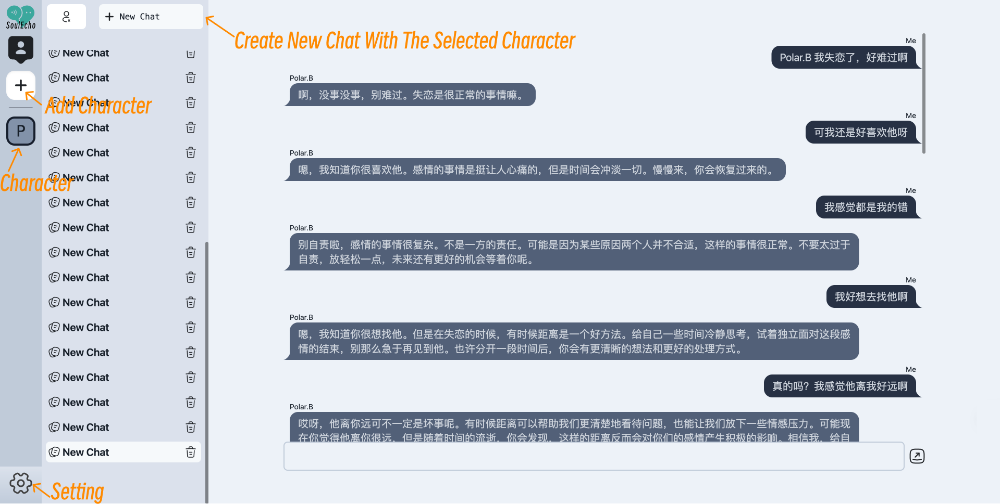

# SoulEcho: Connect Souls, Echo familiar Roles

## 产品介绍

SoulEcho 是一个 AI 聊天软件，能够满足用户情感陪伴的需求并提供正向的心理引导。用户通过上传自己与亲朋好友的少量聊天记录，即可生成具有亲朋好友语言风格和表达方式的聊天 AI。虚拟“亲朋好友”可以提供稳定的情感支持，如倾听、理解和支持，并提供正向的心理引导，帮助用户缓解焦虑、孤独、压力等负面情绪。

## 界面展示




## 后端

### 安装依赖

```shell
pip install -r requirement.txt
```

### 开发运行

```shell
uvicorn main:app --reload
```

### 格式化代码

```shell
black .
```

## 前端

```shell
cd frontend
```

### 安装依赖

```shell
npm install
```

### 运行

```shell
npm run dev
```

### Lint with [ESLint](https://eslint.org/)

```sh
npm run lint
```

## Git hook 实现

由于该项目前后端混合在一个仓库，且前端部分在`.git`所在层级的下一级文件夹中，因此无法直接使用`husky`；
并且 Python 部分也没有对应的库来完成 hook 功能。

但是 hook 能力是由`git`提供的，因此我选择自己借助 hook 实现对应功能。

首先修改 git hook 的配置文件夹，将`.git/config`中的`hooksPath`改为`.husky`。

第二步，前端还是正常安装了 `commitlint`，对于只进行前端开发的同学还是借助 `commitlint` 实现校验。

第三步，后端则是使用 Python 实现了 commit msg 的校验，具体见`.husky/check_commit.py`。

```python
#!/usr/bin/env python
"""
Git commit hook:
 .git/hooks/commit-msg
 Check commit message according to angularjs guidelines:
  * https://docs.google.com/document/d/1QrDFcIiPjSLDn3EL15IJygNPiHORgU1_OOAqWjiDU5Y/edit#
"""
import sys
import re

valid_commit_types = [
    "feat",
    "fix",
    "docs",
    "style",
    "refactor",
    "test",
    "chore",
]

commit_file = sys.argv[1]
help_address = "https://docs.google.com/document/d/1QrDFcIiPjSLDn3EL15IJygNPiHORgU1_OOAqWjiDU5Y/edit#"
with open(commit_file) as commit:
    lines = commit.readlines()
    if len(lines) == 0:
        sys.stderr.write("\nEmpty commit message\n")
        sys.stderr.write("\n - Refer commit guide: %s\n\n" % help_address)
        sys.exit(1)
    # first line
    line = lines[0]
    m = re.search("^(.*): (.*)$", line)
    if not m or len(m.groups()) != 2:
        sys.stderr.write(
            "\nFirst commit message line (header) does not follow format: type: message\n"
        )
        sys.stderr.write("\n - Refer commit guide: %s\n\n" % help_address)
        sys.exit(1)
    commit_type, commit_message = m.groups()
    if commit_type not in valid_commit_types:
        sys.stderr.write(
            "\nCommit type not in valid ones: %s\n" % ", ".join(valid_commit_types)
        )
        sys.stderr.write("\n - Refer commit guide: %s\n\n" % help_address)
        sys.exit(1)
    if len(lines) > 1 and lines[1].strip():
        sys.stderr.write("\nSecond commit message line must be empty\n")
        sys.stderr.write("\n - Refer commit guide: %s\n\n" % help_address)
        sys.exit(1)
    if len(lines) > 2 and not lines[2].strip():
        sys.stderr.write("\nThird commit message line (body) must not be empty\n")
        sys.stderr.write("\n - Refer commit guide: %s\n\n" % help_address)
        sys.exit(1)
sys.exit(0)
```

第四步，实现`commit-msg`和`pre-commit`两阶段的钩子。

前者实现对msg格式的校验；首先尝试对后端开发情况进行校验，其次尝试对前端开发情况校验，并且保证前后端有一个环境进行了配置就可以完成校验。

```shell
python .husky/check_commit.py "$1" || echo 'Python check commit fail.'
cd frontend || exit
if [ -d 'node_modules' ]; then
  npm run check-commit
fi
```

后者实现代码格式化，同样是先尝试后端代码格式化，再尝试前端代码格式检查和格式化(ESLint)，同样保证前后端仅有一个环境在开发时就可以完成该环境的校验。

```shell
#!/bin/sh

black . || echo 'Python format fail.'
cd frontend || exit
if [ -d 'node_modules' ]; then
    npm run lint
fi
git add .
```

